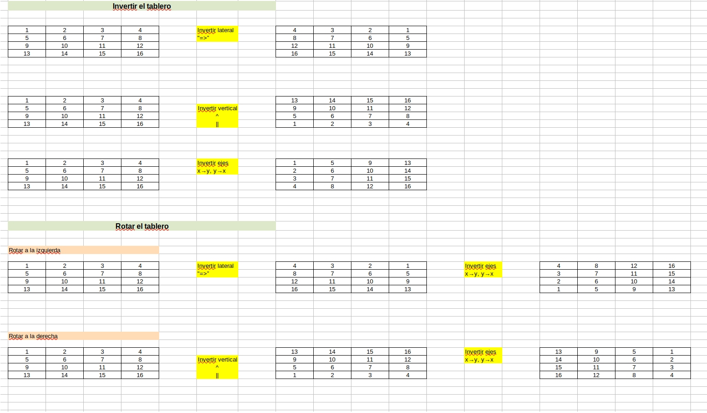

# React

React es una librería de JavaScript que permite crear interfaces de usuario de manera eficiente y escalable. Se usa para construir aplicaciones web modernas y complejas, así como para el desarrollo de aplicaciones móviles y de escritorio. Una de las características clave de React es su enfoque en el diseño declarativo, lo que significa que los programadores describen lo que quieren que el sistema haga en lugar de cómo hacerlo. Esto hace que el código sea más fácil de leer y mantener. Además, React utiliza el modelo de componentes para la creación de interfaces, lo que permite una mayor modularidad y reutilización del código.
# 2048

El 2048 es un juego de rompecabezas que se juega en una cuadrícula de 4x4 usando números con un valor que se dobla cada vez que se desplazan juntos en una dirección. El objetivo del juego es deslizar las casillas numeradas en cualquier dirección para combinar las casillas con el mismo número y crear una casilla con un valor de 2048. Si se llenan todas las casillas de la cuadrícula y ya no se pueden combinar más números, el juego termina. El juego se puede jugar en línea o se puede descargar como una aplicación para dispositivos móviles.
# Puesta en marcha

* Instalar node y git

* Clonar el repositorio con el siguiente comando:
```
git clone https://github.com/LdMe/2048_react.git
```

* Instalar los paquetes necesarios con `npm install` (dentro del repositorio)

* Iniciar el proyecto con `npm start`
# Primera parte: crear la tabla y las celdas:
```jsx
// Board.jsx
import { useEffect, useState,useRef } from "react";
import Tile from "../Tile/Tile";

import "./Board.scss";

const Board = ({action=null}) => {
    const [board, setboard] = useState([
    [0, 0, 0, 0],
    [0, 0, 0, 0],
    [0, 0, 0, 0],
    [0, 0, 0, 0],
    ]);
    
    
    const renderBoard = () => {
        const rows  = board.map((row, rowIndex) => {
            let tiles= row.map((tile, colIndex) => 
                <Tile 
                    value={tile} 
                    key={rowIndex.toString() + colIndex.toString()}
                />
            );
            return (
                <div className="board-row" key={rowIndex}>
                    {tiles}
                </div>
            )
        });
        return (
            <div className="board">
                {rows}
            </div>
        );
    };

    
    return (
        <div className="board-container">
            {renderBoard()}
        </div>
    );
}

export default Board;
```
```jsx
//Tile.jsx
import { useEffect, useState } from "react";
import "./Tile.scss";

const Tile = ({ value }) => {
  
  return (
    <div
      className={`tile `}
    >
     {value? value: <span style={{visibility:"hidden"}}>{ value}</span>}
    </div>
  );
}

export default Tile;
```

# Añadir movimiento a la izquierda

```jsx

//Board.jsx
const [board, setboard] = useState([
[2, 2, 2, 2],
[0, 2, 0, 0],
[0, 0, 0, 0],
[0, 0, 0, 0],
]);
useEffect(() => {

    if (action.action !== "reset") { // si no es el primer movimiento
        setboard(moveLeft(board)); // mover las casillas
    }
}, [action]);
const moveLeft = (board) => {
    const newBoard = board.map((row,rowNum) => { // recorrer las filas
        const newRow = row.map((tile) =>  tile); // copiar la fila
        const merged = [];  // array para guardar las casillas que ya se han combinado
        for (let i = 0; i < newRow.length ; i++) {
            if (newRow[i] !== 0) { // si la casilla no está vacía
                let k = i; 
                while (k > 0 && newRow[k-1] === 0) { // mientras la casilla anterior esté vacía
                    k--;
                }
                if (newRow[k-1] === newRow[i] ) { // si la casilla anterior tiene el mismo valor
                    if (merged.includes(k-1)) { // si la casilla anterior ya se ha combinado
                        newRow[k] = newRow[i]; // mover la casilla a la posición anterior
                        newRow[i] = 0; // vaciar la casilla actual
                        continue;
                    }
                    newRow[k-1] = newRow[i] * 2; // combinar las casillas
                    newRow[i] = 0; // vaciar la casilla actual
                    
                    merged.push(k-1); // añadir la casilla anterior al array de casillas combinadas
                    continue; 
                } 
                if (newRow[k] === 0) { // si la casilla anterior está vacía
                    newRow[k] = newRow[i]; // mover la casilla a la posición anterior
                    newRow[i] = 0; // vaciar la casilla actual
                }
            }
        }
        return newRow; // devolver la fila modificada
    });
    return newBoard; // devolver el tablero modificado
    }; 
```

# Invertir casillas

```jsx
// Board.jsx


useEffect(() => {

    switch (action.action) {
        case "left":
            setboard(moveLeft(board)); // mover las casillas
            break;
        case "right":
            setboard(invertHorizontalArray(board)); // invertir las casillas horizontalmente
            break;
        case "up":
            setboard(invertRowColsArray(board)); // invertir filas y columnas
            break;
        case "down":
            setboard(invertVerticalArray(board)); // invertir filas y columnas y verticalmente
            break;
    }

}, [action]);

const invertHorizontalArray = (array) => {
    return array.map((row) => {
        return row.reverse().map((tile) => { // invertir las casillas de cada fila
            return tile;
        }
        );
    });
};

const invertVerticalArray = (array) => {
    return array.reverse().map((row) => { // invertir las filas
        return row.map((tile) => {
            return tile;
        });
    });
};

const invertRowColsArray = (array) => { // invertir filas y columnas
    const newArray = [];
    for (let i = 0; i < array.length; i++) {
        const newRow = [];
        for (let j = 0; j < array.length; j++) {
            let element = array[j][i]; // intercambiar filas y columnas
            newRow.push(element);
        }
        newArray.push(newRow);
    }
    return newArray;
};
```

# Rotar casillas

```jsx
//Board.jsx
useEffect(() => {

    switch (action.action) {
        case "left":
            setboard(rotateLeft(board)); // mover las casillas
            break;
        case "right":
            setboard(rotateRight(board)); // invertir las casillas horizontalmente
            break;
        case "up":
            setboard(invertRowColsArray(board)); // invertir filas y columnas
            break;
        case "down":
            setboard(invertVerticalArray(board)); // invertir filas y columnas y verticalmente
            break;
    }
}, [action]);

// ...

const rotateLeft = (board) => {
    board = invertHorizontalArray(board);
    board = invertRowColsArray(board);
    return board;
};

const rotateRight = (board) => {
    board = invertVerticalArray(board);
    board = invertRowColsArray(board);
    return board;
};
```

# Crear una casilla aleatoria

```jsx

// Board.jsx

useEffect(() => {
    let newBoard;
    switch (action.action) {
        case "left":
            newBoard = moveLeft(board);
            setboard(createRandomTile(newBoard));
            break;
        case "right":
            newBoard = moveRight(board);
            setboard(createRandomTile(newBoard));
            break;
        case "up":
            newBoard = moveUp(board);
            setboard(createRandomTile(newBoard));
            break;
        case "down":
            newBoard = moveDown(board);
            setboard(createRandomTile(newBoard));
            break;
    }
    

    
}, [action]);

//...

const getEmptyTiles = (board) => {
    const emptyTiles = [];
    for (let i = 0; i < board.length; i++) {
        for (let j = 0; j < board.length; j++) {
            if (board[i][j] === 0) {
                emptyTiles.push([i,j]);
            }
        }
    }
    return emptyTiles;
};

const createRandomTile = (board) => {
    const emptyTiles = getEmptyTiles(board);
    if (emptyTiles.length === 0) {
        return board;
    }
    // seleccionamos una casilla vacía aleatoria
    const randomTile = emptyTiles[Math.floor(Math.random() * emptyTiles.length)];
    // asignamos un valor aleatorio a la casilla (2 o 4)
    board[randomTile[0]][randomTile[1]] = Math.random() < 0.9 ? 2 : 4;
    return board;
};

```


# Animación casilla más grande

```jsx
// Tile.jsx

import { useEffect, useState } from "react";
import "./Tile.scss";

const Tile = ({ value }) => {
  const [bigger, setBigger] = useState(false);
  useEffect(() => {
    if (value !== 0) {
      setBigger(true);
      setTimeout(() => {
        setBigger(false);
      }, 500);

    }
  }, [value]);
  return (
    <div
      className={`tile tile-${Math.min(2048,value)} ${bigger && "bigger"}`}
    >
     {value? value: <span style={{visibility:"hidden"}}>{ value}</span>}
    </div>
  );
}

export default Tile;

```